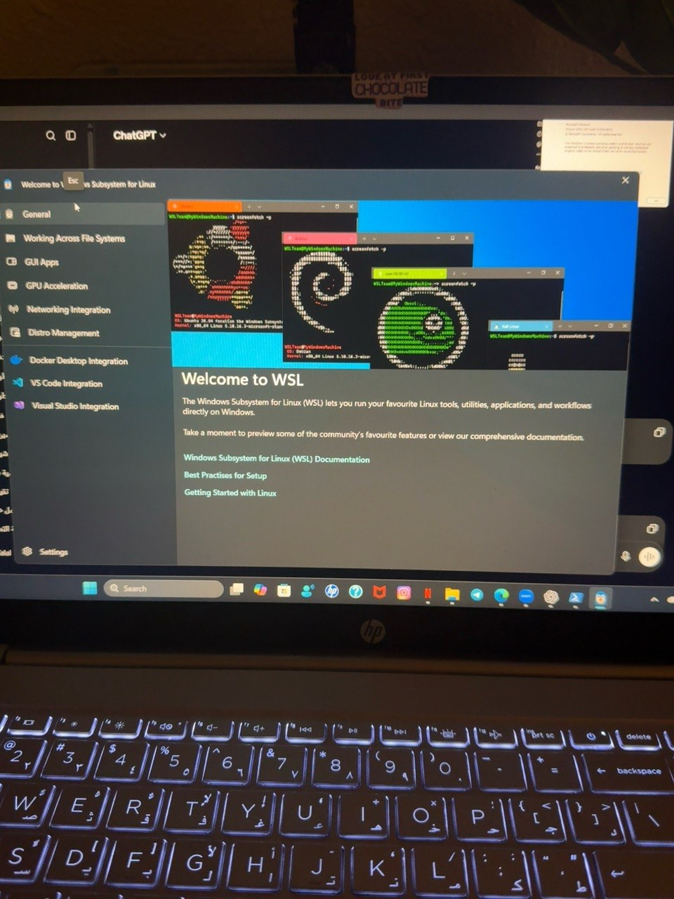
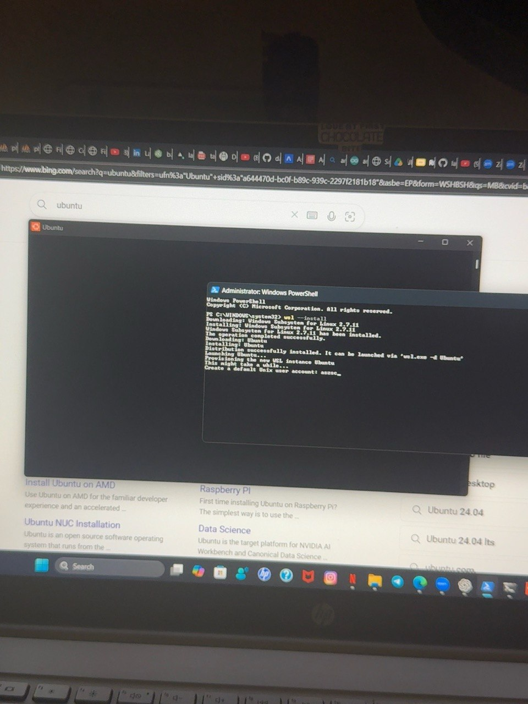
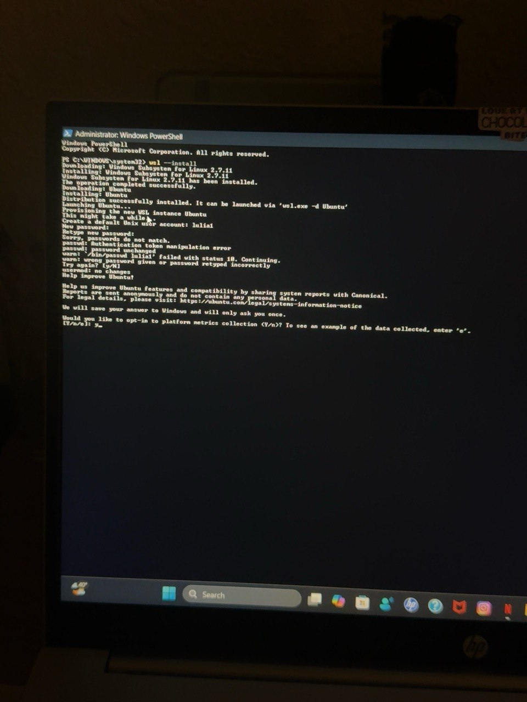
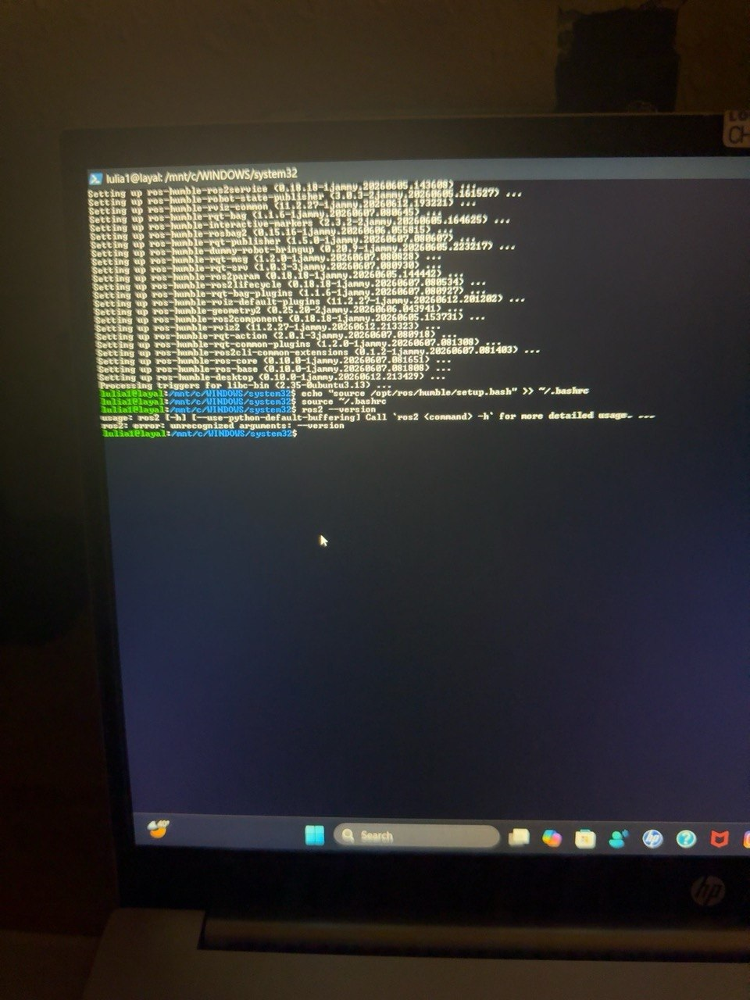
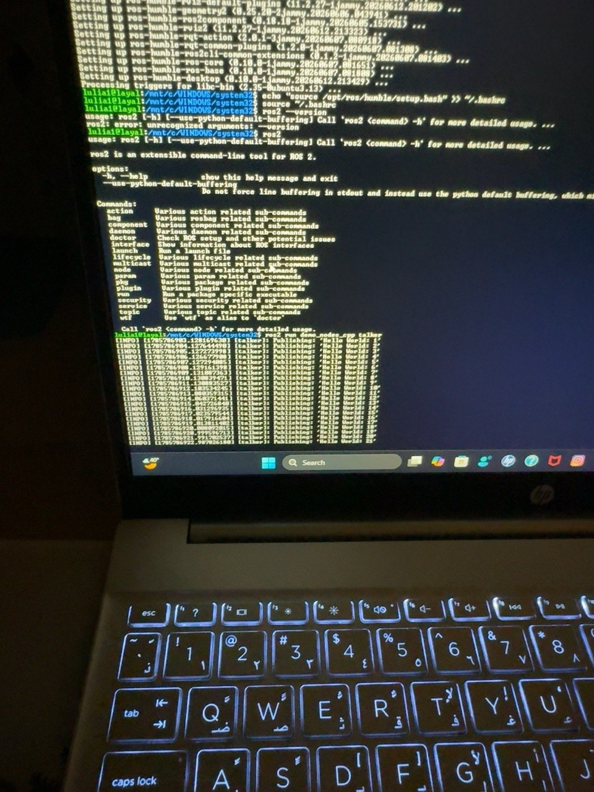

# 🤖 ROS 2 Installation on Ubuntu 22.04 (WSL)

> Installing Ubuntu 22.04 and ROS 2 Humble on Windows using Windows Subsystem for Linux (WSL).

---

## 📌 Project Overview

This project documents the complete installation process of **Ubuntu 22.04 LTS** and **ROS 2 Humble** using **Windows Subsystem for Linux (WSL)** on Windows.

The objective was to successfully install Linux, configure ROS 2, verify that the installation works correctly, and document the entire process, including the issues encountered and how they were resolved.

---

## 🛠️ Technologies Used

- 🪟 Windows 11
- 🐧 Windows Subsystem for Linux (WSL)
- 📦 Ubuntu 22.04 LTS
- 🤖 ROS 2 Humble
- 💻 Windows PowerShell

---

## 🚀 Installation Process

- ✅ Installed Ubuntu 22.04 using WSL.
- 👤 Created a Linux user account.
- 🔄 Updated Ubuntu packages.
- 📥 Added the ROS 2 repository.
- 📦 Installed ROS 2 Humble Desktop.
- ⚙️ Configured the ROS environment.
- ✔️ Verified the installation.
- 🎉 Executed the ROS 2 Hello World publisher demo successfully.

---

## ⚠️ Challenges

During the setup, I encountered a **password authentication error** while configuring Ubuntu. Since the password could not be recovered, I removed the existing Ubuntu installation and installed a fresh Ubuntu 22.04 instance. After creating a new user account, the installation proceeded successfully without further issues.

---

## ✅ Verification

The installation was verified by:

- Running the ROS 2 command line successfully.
- Confirming that the **Humble** distribution was installed.
- Running the **Hello World Publisher Demo**, which continuously published messages without errors.

---

# 📸 Screenshots

## 🐧 WSL Welcome

  

---

## 📦 Ubuntu Installation

  

---

## 🔐 Password Authentication Error

  

---

## 🤖 ROS 2 Successfully Installed

  

---

## 🎉 Hello World Demo

  

## 🌟 Result

ROS 2 Humble was successfully installed and configured on Ubuntu 22.04 running through WSL. The environment was verified by executing the Hello World publisher demo, confirming that the installation was completed successfully.
